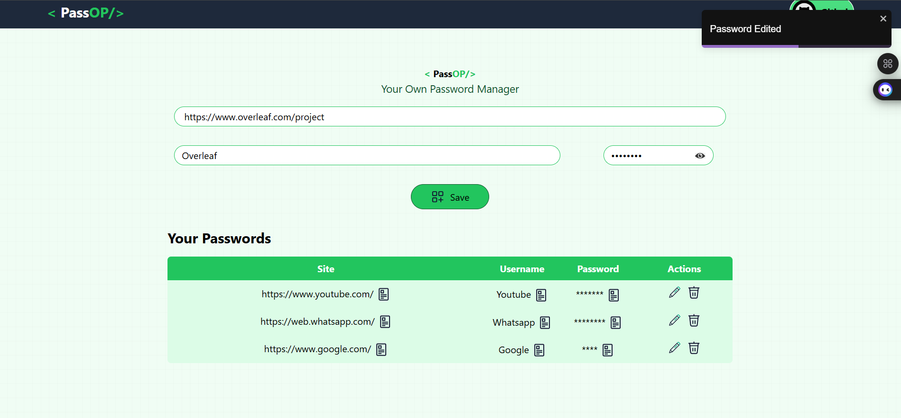
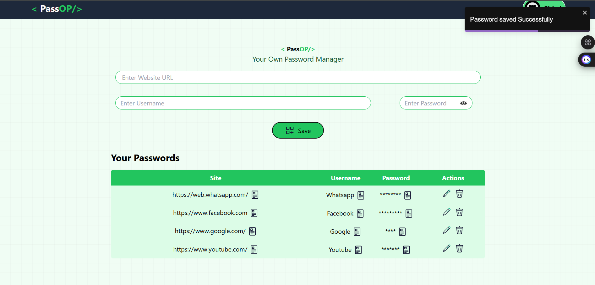

# 🔐 Passop - React Password Manager

Welcome to **Passpo**, a secure and elegant password manager built with **React.js** and **MongoDB**. This project focuses on core full-stack development skills while emphasizing user experience through animated icons, encrypted storage, and toast notifications.

---

## 📱 About the Website

**Passop** is a simple yet effective password manager that allows users to store their credentials (URL, username/email, and password) securely. The app ensures smooth usability with animations and real-time feedback using Toastify notifications.

All passwords are stored in a **MongoDB Compass** database with encryption applied to ensure basic data protection. This project highlights my ability to build connected frontend-backend systems with a polished UI.

---

## ✨ Features

- ✅ **Add New Passwords**: Save credentials with fields for URL, username/email, and password.
- ✅ **Edit/Delete Entries**: Update or remove existing records easily.
- ✅ **Password Encryption**: All passwords are encrypted before being stored in the database.
- ✅ **Toast Notifications**: Clear success and error messages via Toastify.
- ✅ **Animated Icons**: Smooth icon animations enhance the user interface.
- ✅ **Local Storage**: Data is securely saved to a local MongoDB (via Compass).

---

<h3>Screenshots</h3>

  
  
  

## 🛠️ Tech Stack

- **Frontend**: React.js, Tailwind CSS, React Icons, React Toastify  
- **Backend**: Node.js, Express.js  
- **Database**: MongoDB (Compass - local NoSQL storage)  
- **Other Tools**: Git, VS Code

---

## 📌 Motivation

I created **Passop** to deepen my understanding of React, REST APIs, and data handling using MongoDB. It reflects my ability to design intuitive interfaces, encrypt sensitive data, and manage full-stack workflows. It also demonstrates my interest in building tools that prioritize both security and user experience.

---

## 🚀 Future Improvements

- 🔐 Move to **MongoDB Atlas** for deployment and cloud access  
- 🧠 Integrate **stronger encryption** (e.g., bcrypt or crypto modules)  
- 👤 Add authentication to support multi-user storage  
- ☁️ Host the full-stack app using Render or Vercel  

---

## 📫 Contact

I'm open to opportunities and collaborations!

📧 Reach out to me at [saicharanchilla7777@gmail.com](mailto:saicharanchilla7777@gmail.com)  
🔗 Connect with me on [LinkedIn](https://www.linkedin.com/in/saicharan-chilla-2b2201271/)  
💻 Check out more of my work on [GitHub](https://github.com/228w1a1278)

---

